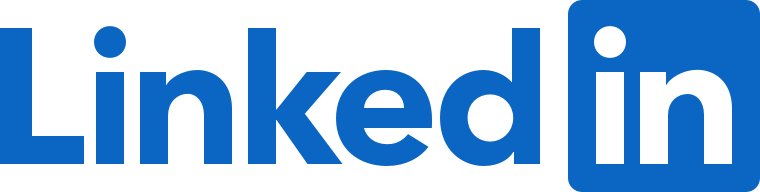
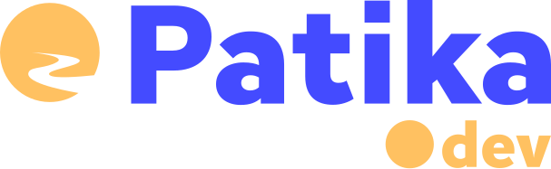
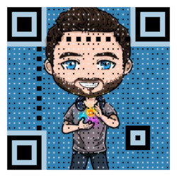

### Summary

Product development engineer with agile and curious mindset 🧠, utilizing ux principles at work 🚀. My features skills are analytical thinking, problem solving and creativity. My hobbies are 🏊 Swimming,
♟️ Chess,
🎮 RC Vehicles,
💭 Philosophy,
⛰️ Hiking. I study my masters degree at Istanbul Technical University Computational Sci. and Eng. Dept. 🧑‍💻

### My top languages:

,
,
,
,

### My favourite tools/frameworks/dbms etc.:

,
,
,
,
,
,
,

### Communication channels:

 &emsp;
 &emsp;
 &emsp;

<!--
### Scan to connect:

**dorukolcmener/dorukolcmener** is a ✨ _special_ ✨ repository because its `README.md` (this file) appears on your GitHub profile.

Here are some ideas to get you started:

- 🔭 I’m currently working on ...
- 🌱 I’m currently learning ...
- 👯 I’m looking to collaborate on ...
- 🤔 I’m looking for help with ...
- 💬 Ask me about ...
- 📫 How to reach me: ...
- 😄 Pronouns: ...
- ⚡ Fun fact: ...
-->
